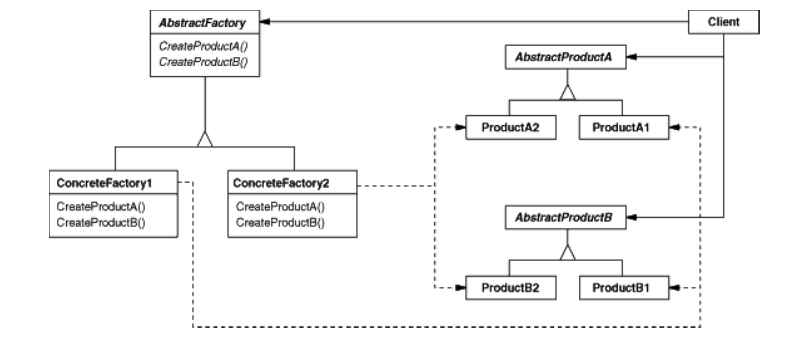

# Abstract Factory
Provide an interface for creating families of related or dependent objects without
specifying their concrete classes.

The abstract factory pattern provides a way to encapsulate a group of individual factories that have a common theme without specifying their concrete classes.

## Participants
* AbstractFactory (WidgetFactory)
  * declares an interface for operations that create abstract product objects.
* ConcreteFactory (MotifWidgetFactory, PMWidgetFactory) (basically are Factory pattern)
  * implements the operations t* create concrete product objects.
* AbstractProduct (Window, ScrollBar)
  * declares an interface for a type of product object.
* ConcreteProduct (MotifWindow, MotifScrollBar)
  * defines a product object t* be created by the corresponding concrete
factory.
  * implements the AbstractProduct interface.
* Client
  * uses only interfaces declared by AbstractFactory and AbstractProduct
classes.