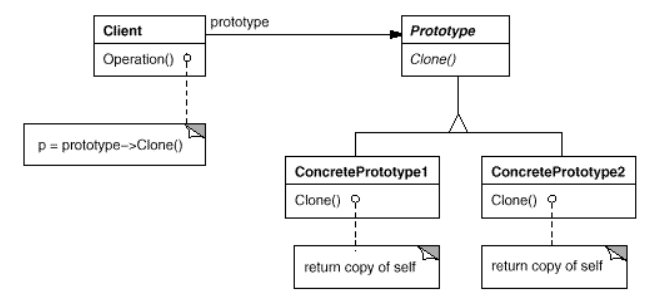

# Prototype
Specify the kinds of objects to create using a prototypical instance, and create new objects by copying this prototype.

# Java 
implement cloneable
This is shallow clone - which mean his field stay the same (not primitive save by reference) changes may occurs to all classes.

Solving shallow clone you may create new instance or clone them too.

Implements in java cloneable.

# Class

* Prototype (Graphic)
  * declares an interface for cloning itself.
* ConcretePrototype (Staff, WholeNote, HalfNote)
  * implements an operation for cloning itself.
* Client (GraphicTool)
  * creates a new object by asking a prototype to itself.