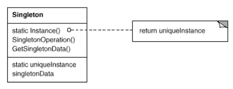

# Singleton - Single Instance
Ensure a class has one instance, and provide a global point of access to it.

It cannot be inherited from. To add new functionality, a new class cannot be descended to contain that functionality, breaking Separation of Concern.

## Common uses
* The abstract factory, factory method, builder, and prototype patterns can use singletons in their implementation.
* Facade objects are often singletons because only one facade object is required.
* State objects are often singletons.
* Singletons are often preferred to global variables 

## Assignment
build a thread safe implementation which has a single log (Shop Class)