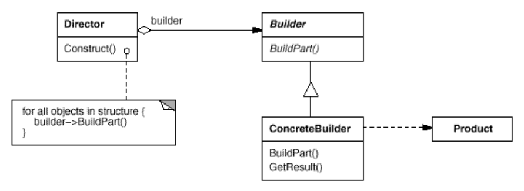

# Builder 
Separate the construction of complex object from its representation so that same construction process can create different representations.

## Applicability
Use the Builder pattern when
1. the algorithm for creating a complex object should be independent of the parts that make up the object and how they're assembled.
2. the construction process must allow different representations for the object that's constructed.

## Assignment
Random sentence generator using multi type of sentence grammar (Past,Present,Simple,When)