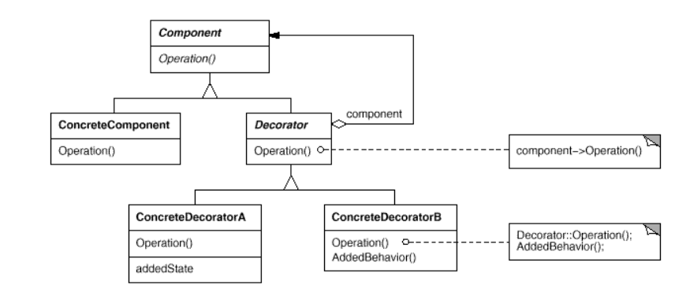

# Decorator
decorator pattern that allows behavior to be added to an individual object, dynamically, without affecting the behavior of other objects from the same class.\
Attach additional responsibilities to an object dynamically. Decorators provide a flexible alternative to sub-classing for extending functionality.\
The decorator pattern is often useful for adhering to the Single Responsibility Principle, as it allows functionality to be divided between classes with unique areas of concern.

Specific composite(in composite the operation is general)
```java
//decoretor
public void operation(){
    component.operation();
    this.privateOperation();
}
```


