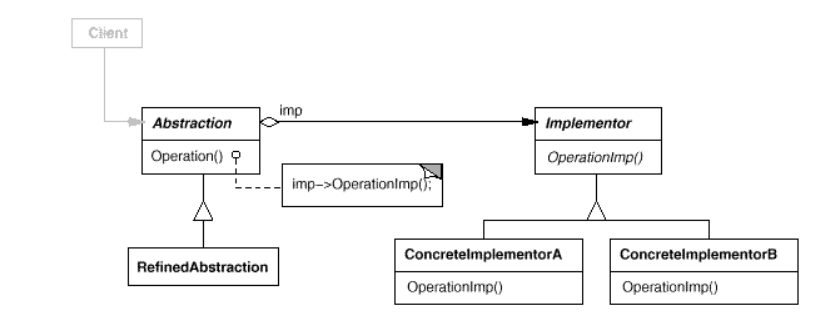

# Bridge
Decouple an abstraction from its implementation so that the two can vary independently.

The bridge pattern is a design pattern used in software engineering that is meant to "decouple an abstraction from its implementation so that the two can vary independently", introduced by the Gang of Four.

