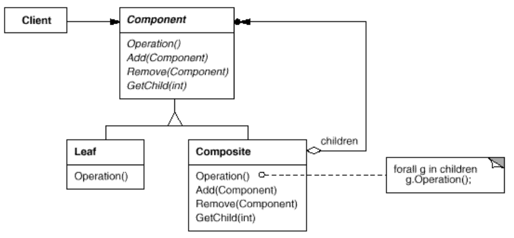

# Composite - Leaf and Composite
Structural pattern which, Compose objects into tree structures to represent part-whole hierarchies. Composite lets clients treat individual objects and compositions of objects uniformly.

## Known Uses
gut application each inner part is composite, until you reach to leaf part like buttons 
## Exercise 
some composite example :
* File == leaf
* Folder == composite