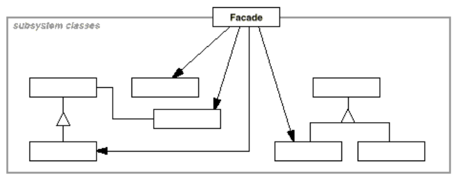

# Facade - Front-facing interface
facade is an object that serves as a front-facing interface masking more complex underlying or structural code.

Provide a unified interface to a set of interfaces in a subsystem. Facade defines a higher-
level interface that makes the subsystem easier to use.

## Applicability 
* improve the readability and usability of a software library by masking interaction with more complex components behind a single (and often simplified) API
* provide a context-specific interface to more generic functionality (complete with context-specific input validation)
* serve as a launching point for a broader refactor of monolithic or tightly-coupled systems in favor of more loosely-coupled code

## Assignment
Manage a trip predations using facade