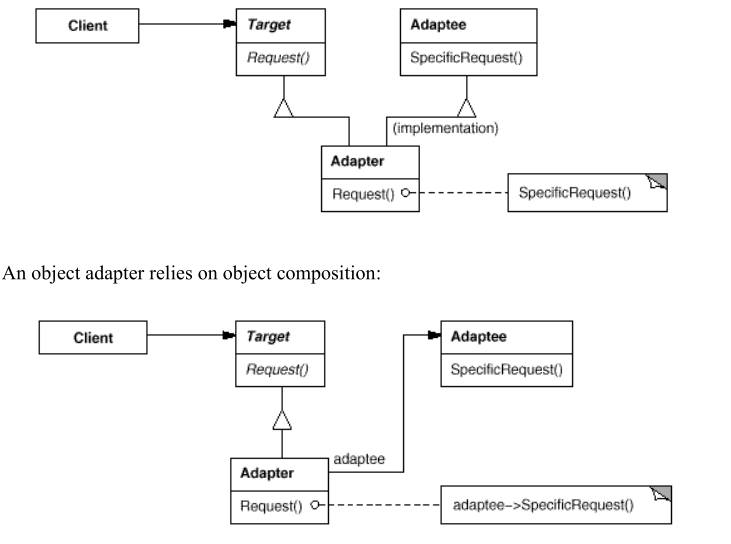

# Adapter
adapter pattern that allows the interface of an existing class to be used as another interface.\
Adapter lets classes work together that couldn't otherwise because of incompatible interfaces.

* Target (Shape): defines the domain-specific interface that Client uses.
* Client (DrawingEditor): collaborates with objects conforming to the Target interface.
* Adaptee (TextView): defines an existing interface that needs adapting.
* Adapter (TextShape): adapts the interface of Adaptee to the Target interface.

**note**: in case you implement with class variable you must get the requested class (usually truth the constructor)
## Applicability
Use the Adapter pattern when
* you want to use an existing class, and its interface does not match the one you
need.
* you want to create a reusable class that cooperates with unrelated or unforeseen
classes, that is, classes that don't necessarily have compatible interfaces.
* (object adapter only) you need to use several existing subclasses, but it's
impractical to adapt their interface by subclassing every one. An object adapter
can adapt the interface of its parent class.