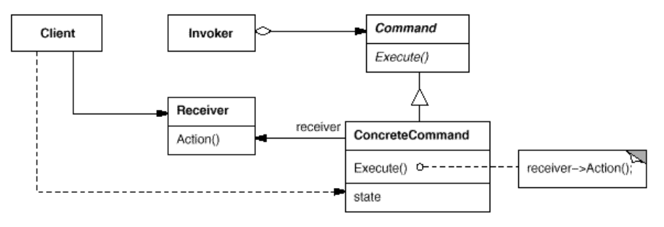

# Command - CallBack
Behavior Pattern which, Encapsulate a request as an object, letting you parameterize clients with different requests.


# Applicability
1. You can express such parameterization in a procedural language with a callback.\
   function, that is, a function that's registered somewhere to be called at a later point.
2. specify, queue, and execute requests at different times. A Command object can have a lifetime independent of the original request.
3. support undo. The Command's Execute operation can store state for reversing its effects in the command itself.

```java
//simple Example from Source display the relation between each Class
SimpleRemoteControl remote = new SimpleRemoteControl();
Light light = new Light();
LightOnCommand lightOn = new LightOnCommand(light);
remote.setCommand(lightOn);
remote.buttonWasPressed();
```

## Assignment
build a remote to open light and garage door.\
[solution source]( https://github.com/bethrobson/Head-First-Design-Patterns )

| Story               | Pattern elements |
| ------------------- | ---------------- |
| RemoteControlTest   | Client           |
| Light               | Receiver         |
| LightOnCommand      | ConcreteCommand  |
| SimpleRemoteControl | Invoker          |