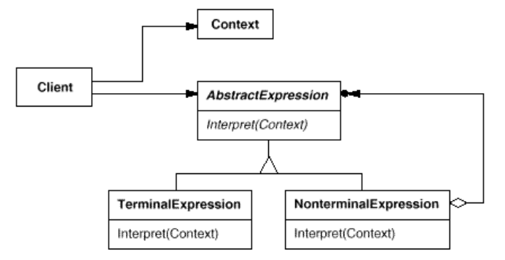

# Interpreter - Build your own Language
Given a language, define a representation for its grammar along with an interpreter that uses the representation to interpret sentences in the language.

## Assignment
1. Languages calculator
2. Language Hex