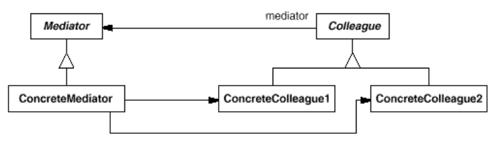

# Mediator
Define an object that encapsulates how a set of objects interact. Mediator promotes
loose coupling by keeping objects from referring to each other explicitly, and it lets you
vary their interaction independently.

## Consequences
The Mediator pattern has the following benefits and drawbacks:
1. It limits subclassing. A mediator localizes behavior that otherwise would be
distributed among several objects. Changing this behavior requires subclassing
Mediator only; Colleague classes can be reused as is.
2. It decouples colleagues. A mediator promotes loose coupling between
colleagues. You can vary and reuse Colleague and Mediator classes
independently.
3. It simplifies object protocols. A mediator replaces many-to-many interactions
with one-to-many interactions between the mediator and its colleagues. One-to-
many relationships are easier to understand, maintain, and extend.
4. It abstracts how objects cooperate. Making mediation an independent concept
and encapsulating it in an object lets you focus on how objects interact apart
from their individual behavior. That can help clarify how objects interact in a
system.
5. It centralizes control. The Mediator pattern trades complexity of interaction for
complexity in the mediator. Because a mediator encapsulates protocols, it can
become more complex than any individual colleague. This can make the
mediator itself a monolith that's hard to maintain.

## Example
plain mediator