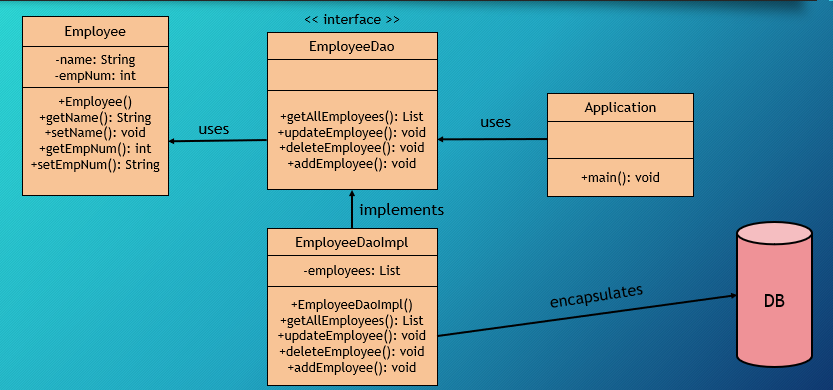
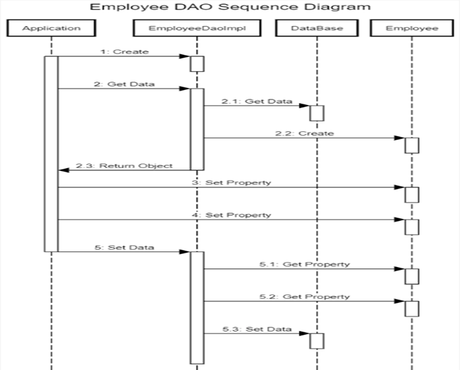

# Data Access Object
Interface which its main objective is accessing data from a database.\
Manage Connection with 

## Structure
* Model - transfer between the pattern's layers.
* Interface - API for implementation
* Concrete implementation - imp