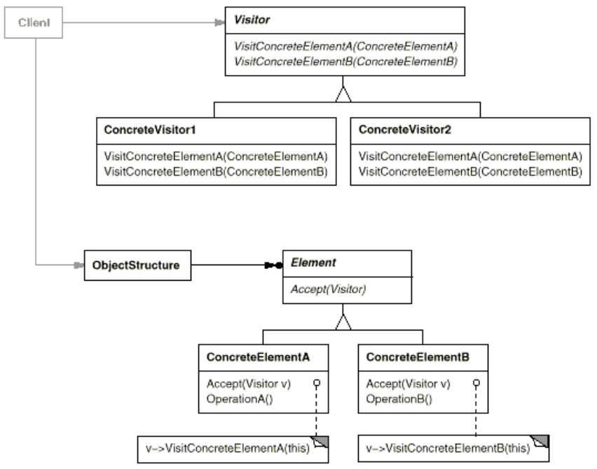

# Visitor

## Intent
Represent an operation to be performed on the elements of an object structure. Visitor
lets you define a new operation without changing the classes of the elements on which it
operates.

## Motivation 
With the Visitor pattern, you define two class hierarchies: one for the elements being
operated on (the Node hierarchy) and one for the visitors that define operations on the
elements (the NodeVisitor hierarchy).

## Applicability
1. object structure contains many classes of objects with different interfaces, want to perform operations on these objects that depend on their concrete classes.
2. distinct and unrelated operations need to be performed on objects, and want to "polluting" their classes with these operations.\
   Visitor lets you keep related operations together by defining them in one class.
3. Classes defining the object structure rarely change, but you often want to define new operations over the structure.

## Collaborations
* Like DFS - ConcreteVisitor object and then traverse the object structure, visiting each element with the visitor.

## Consequences
1. Visitor makes adding new operations easy.
2. A visitor gathers related operations and separates unrelated ones.
3. Adding new ConcreteElement classes is hard.
   1. So the key consideration in applying the Visitor pattern is whether you are mostly likely to change the algorithm applied over an object structure or the classes of objects that make up the structure.
   2. The Visitor class hierarchy can be difficult to maintain when new ConcreteElement classes are added frequently.
4. Visiting across class hierarchies. 
5.  Accumulating state. Visitors can accumulate state as they visit each element in the object structure. Without a visitor, this state would be passed as extra arguments to the operations that perform the traversal, or they might appear as global variables.
6.  Breaking encapsulation. Visitor's approach assumes that the ConcreteElement
interface is powerful enough to let visitors do their job. As a result, the pattern
often forces you to provide public operations that access an element's internal
state, which may compromise its encapsulation.